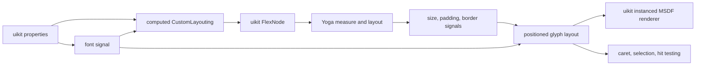
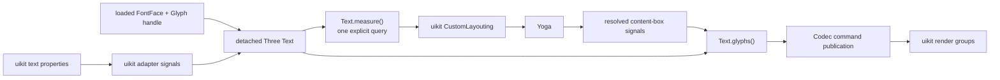

# uikit integration

This document is for maintainers integrating `pmndrs/glyph` into pmndrs/uikit. It explains the seam in uikit's current
Three-based implementation, the Glyph `Text` queries it uses, and an incremental migration that does not require uikit to
replace layout, rendering, and editing at once.

The authoritative public types remain in the [Glyph integration API](core-api.md). This page owns uikit-specific reasoning; uikit terminology and dependencies do not belong in the core package.

## Evidence from uikit today

This analysis is pinned to pmndrs/uikit commit [`0d4d887343d4492234ac9f35a4c470cea4176ca0`](https://github.com/pmndrs/uikit/tree/0d4d887343d4492234ac9f35a4c470cea4176ca0).

uikit's current `Text` component does not perform an explicit imperative measure-and-commit protocol. It wires text into uikit's existing reactive layout system:

1. [`Text`](https://github.com/pmndrs/uikit/blob/0d4d887343d4492234ac9f35a4c470cea4176ca0/packages/uikit/src/components/text.ts) resolves a font signal and calls `setupTextLayout`.
2. [`setupTextLayout`](https://github.com/pmndrs/uikit/blob/0d4d887343d4492234ac9f35a4c470cea4176ca0/packages/uikit/src/text/layout/index.ts) produces a `CustomLayouting` signal for Yoga and a positioned-layout signal for rendering.
3. [`computedCustomLayouting`](https://github.com/pmndrs/uikit/blob/0d4d887343d4492234ac9f35a4c470cea4176ca0/packages/uikit/src/text/layout/measure.ts) supplies `minWidth`, `minHeight`, and a synchronous Yoga measure callback.
4. [`FlexNode`](https://github.com/pmndrs/uikit/blob/0d4d887343d4492234ac9f35a4c470cea4176ca0/packages/uikit/src/flex/node.ts) installs that callback, rounds its result upward to uikit's point scale, marks the Yoga node dirty, and publishes final size, padding, and border signals after Yoga calculates layout.
5. The positioned-layout signal subtracts padding and borders from the resolved node size and rebuilds glyph positions for that content box.
6. [`InstancedText`](https://github.com/pmndrs/uikit/blob/0d4d887343d4492234ac9f35a4c470cea4176ca0/packages/uikit/src/text/render/instanced-text.ts) turns those entries into uikit-owned instances.



The existing font and layout model is intentionally limited: BMFont/MSDF metrics, pair kerning, and one character entry per rendered glyph. [`Font`](https://github.com/pmndrs/uikit/blob/0d4d887343d4492234ac9f35a4c470cea4176ca0/packages/uikit/src/text/font.ts) owns both atlas data and character metrics. [`query.ts`](https://github.com/pmndrs/uikit/blob/0d4d887343d4492234ac9f35a4c470cea4176ca0/packages/uikit/src/text/layout/query.ts) derives carets and selections from per-character entries. Modern clusters, ligatures, combining marks, and bidi output cannot be represented faithfully by preserving those assumptions.

## The replacement seam

uikit should continue to own:

- Preact signals and property inheritance;
- Yoga nodes, flex constraints, padding, borders, and overflow;
- component readiness, invalidation, clipping, transforms, ordering, and scene lifecycle;
- uikit-specific batching and root render integration.

`pmndrs/glyph` should own:

- registered font resources and shaping readiness;
- shaping, clusters, line breaking, alignment, and paragraph caches;
- intrinsic and constrained paragraph measurement;
- final positioned glyph output in content-box-local coordinates;
- the effective per-glyph em size required to render mixed-size spans;
- raster-module resources and conversion of a paragraph layout into draw batches.

The integration becomes a small uikit-owned adapter around an ordinary detached Three `Text`:



There is no `YogaAdapter` in `@pmndrs/glyph`, no Preact signal type in its API, and no uikit matrix or clipping type in a raster module. uikit translates its values at the boundary.

## Measurement API

uikit already renders through Three, so it uses the same handle-owned `Text` as every other Three consumer:

```ts
import { glyph } from '@pmndrs/glyph';
import { ThreeConfig } from '@pmndrs/glyph/three';

await glyph.init();
const three = glyph.handle('uikit', ThreeConfig);
const text = three.createText({ font, text: value, style, layout });

text.constraints = constraints;
const metrics = text.measure();

text.constraints = resolvedContentBox;
const positioned = text.glyphs();
```

`Text.measure()` and `Text.glyphs()` answer synchronously from desired state before scene attachment or a committed frame.
Each call is an explicit one-Text query and may pay one Wasm crossing; neither traverses matrices, publishes a command
buffer, nor realizes renderer resources. Normal rendering still batches every dirty root through one `glyph.shape()`
crossing. This is safe inside Yoga's measure callback and avoids a second hidden measurement runtime (D-339).

`Constraints` carries only the axes (`width`, `height`) that a host varies while probing one node; wrap, alignment,
`maxLines`, overflow, justification bounds, columns, and indents remain in `text.layout`.

`measure()` returns `ParagraphLayoutSummary`, including intrinsic `minContentWidth`/`maxContentWidth`, box size, content
extents, baselines, and overflow without per-glyph arrays. Invalid constraints and engine failures throw from the query.
`glyphs()` materializes caller-owned positioned arrays only after Yoga resolves the final content box.

This separation matters for Yoga and other retained layout engines: they may measure a leaf repeatedly before resolving its final dimensions. Measurement must not allocate or copy the complete render output each time.

## Measurement feedback discipline

One rule is a hard requirement, not an adapter preference: **round a measured width up to the host's point scale before feeding it back as the next constraint.** Do this after the host's padding, border, and box-model arithmetic.

Glyph now outward-rounds retained f64 measurement extents at its public f32 ABI, so a raw Glyph measure→exact loop does
not publish less width than the line it just admitted. Earlier nearest rounding flipped line counts at 39 of 811
fractional widths. The engine correction uses no epsilon: line fitting remains exact F16.16, and the published f32 is the
smallest representable value at or above the retained extent. Host arithmetic can still subtract padding or borders and
land below that value, so the repository's uikit fixture retains `roundUpToPointScale` at the final host boundary.

The stable pattern for a Yoga measure callback:

```ts
text.constraints = constraints;
const measured = text.measure();
return {
  width: Math.ceil(measured.width * pointScale) / pointScale,
  height: Math.ceil(measured.height * pointScale) / pointScale,
};
```

Rounding up (never to-nearest) guarantees the committed box is at least as wide as the measured content, so the final layout reproduces the measured breaks. One adjacent note for integrators: sessions on builds before the metric-topology fix (PR #66) could enter a permanent failed-update storm when an animated font size crossed value-equality with its surroundings — upgrade past that fix before profiling.

## The paragraph-scoped measure fast path (11.17)

Repeated measurement is no longer a full frame transaction. When the only pending change on a `Text` is constraints
(exactly the Yoga measure-callback shape), `measure()` routes to the engine's
paragraph-scoped synchronous query: validation and speculative preparation run for that paragraph alone, the answer is
copied from the inactive result slot, and no publication flip, revision advance, or renderer-fence acknowledgment
happens. The engine retains the speculative work as one transaction — sequential measures at different constraints
re-run only geometry, flow, and positioning over the retained shaping — and the next ordinary frame that commits the
same inputs adopts that exact work, including the reserved stable glyph identities, without a checkpoint rebuild.

Integration consequences:

- Measure-then-commit per frame costs one geometry/flow/positioning pass plus one adopted (near-free) frame, not two
  full session updates, and the frame after a measure no longer pays a checkpoint.
- The fast path engages when only the measured `Text`'s geometry changed; pending text/style edits or other dirty
  paragraphs fall back to the committing path, which stays correct.
- The round-up rule above still applies unchanged: the fast path removes the cost of the measure loop, not the
  knife-edge break flapping that unrounded feedback causes.

## Mapping into current uikit

The first adapter can preserve uikit's existing signal shape:

```ts
const customLayouting = computed(() => {
  const text = textSignal.value;
  if (text == null) return undefined;

  const natural = text.measure();
  return {
    minWidth: natural.minContentWidth,
    minHeight: natural.height,
    measure(width, widthMode, height, heightMode) {
      text.constraints = {
        width: mapAxis(width, widthMode),
        height: mapAxis(height, heightMode),
      };
      const result = text.measure();
      return { width: result.width, height: result.height };
    },
  };
});
```

One measurement now answers everything: intrinsic `minContentWidth` rides the natural pass (the engine scans the cluster arena with the breaker's own wrap decisions), so uikit's old second full measure at zero width is gone. The exact normalization belongs to the uikit adapter because its current minimum-size behavior and point-scale rounding are uikit policies, not font-system invariants.

After Yoga updates uikit's existing size, padding, and border signals, a computed signal sets the final content-box constraints and calls `text.glyphs()`. This is the reactive equivalent of a final positioned query; uikit does not need a second retained runtime or a new imperative lifecycle.

The adapter must preserve these existing behaviors:

- an undefined Yoga axis ignores its numeric payload, including `NaN`;
- constrained values are finite and nonnegative before reaching core;
- uikit retains its point-scale rounding at the Yoga boundary;
- padding and border are removed before paragraph measurement and layout;
- paragraph positions are translated into uikit's centered local coordinate system only after layout;
- text, style, or paragraph-layout changes update the paragraph and dirty the Yoga node;
- renderer materials, raster uniforms, transforms, and clipping remain outside paragraph measurement.

Core supports both axes even though current uikit text measurement primarily branches on the width mode. uikit can adopt height constraints without changing the paragraph API.

## Incremental uikit migration

### 1. Add a shadow adapter

Create a detached Glyph `Text` beside the existing glyph layout. Feed it the same text and effective properties, compare
its metrics against current uikit fixtures, and keep the existing renderer authoritative. This proves readiness,
invalidation, and unit conversion without changing visuals.

### 2. Replace measurement

Set `Text.constraints`, then use `Text.measure()` to populate the existing `CustomLayouting` object. Keep `FlexNode`,
Yoga, point-scale rounding, size signals, and the old renderer unchanged.

### 3. Replace positioned layout and rendering

Set the resolved content-box constraints and call `Text.glyphs()`. The same Text remains available for normal Codec
publication into uikit's Three hierarchy; there is no parallel renderer-free object to reconcile.

### 4. Replace interaction queries

Current selection code indexes one layout entry per JavaScript character. Replace it with `/core`'s
`createGlyphPlacements()` over the `GlyphLayoutInspection`, source text, and uikit's drawn origins. Its cluster-aware
`caretAt()`, `caretForOffset()`, and `selectionRects()` preserve bidi, ligature, surrogate, combining-mark, soft-wrap,
and hard-break boundaries; uikit must not reconstruct character boundaries from glyph IDs.

### 5. Remove the legacy text subsystem

Delete the BMFont-specific `Font`, wrappers, positioned character entries, and MSDF-only instancing only after text, textarea, selection, clipping, and lifecycle fixtures pass through the new path.

## Text-measurement fixture status

The repository's uikit-shaped fixture runs the real detached Three `Text` query path. It deliberately implements only the
reviewed `CustomLayouting → FlexNode/Yoga modes → resolved size/padding/border signals → positioned layout` contract; it
does not pretend to be the production uikit adapter.

| Text-query proof                                | Status | Evidence                                                                                                                                                      |
| ----------------------------------------------- | :----: | ------------------------------------------------------------------------------------------------------------------------------------------------------------- |
| Intrinsic measurement and first baseline        |   ✅   | Exact `minWidth` (published intrinsic width), `minHeight`, and first-baseline values come from one natural measurement of a prepared Inter paragraph.         |
| Yoga mode translation                           |   ✅   | `Undefined`, `AtMost`, and `Exactly` cover ignored `NaN`, finite nonnegative constraints, and the definite-two-axis no-measure path.                          |
| Allocation-light repeated measurement           |   ✅   | Twenty-four constrained probes reuse the engine's retained speculative transaction (shaping fingerprint match) and never materialize positioned glyph arrays. |
| Final content-box layout                        |   ✅   | Padding and border are removed from the resolved outer box before one final layout; host translation produces the exact centered-coordinate golden.           |
| Point-scale rounding and invalidation ownership |   ✅   | Upward rounding remains in the host fixture; text/shaping changes dirty measurement while paint/raster changes do not.                                        |
| Real-product execution                          |   ✅   | Vitest, Chromium 149, and the WebGPU-active Vitexec lane validate the same generated contract and portable hash.                                              |

The fixture sets Three `Text` constraints for each Yoga probe but never forces scene traversal or command publication.
Its retained bidi contract continues to pin the single-pass intrinsic width instead of a degenerate zero-width flow
extent.

Renderer batching, clipping integration, React reconciliation, and cluster-aware interaction remain later integration gates. Closing this paragraph boundary does not claim those production-uikit migration stages are complete.

## Validation gates

The integration fixture must exercise the actual uikit seam rather than a generic Yoga demo:

- `CustomLayouting` creation from a prepared paragraph;
- repeated synchronous measurement without positioned-glyph allocation;
- undefined, constrained, and exact width behavior;
- a resolved content box different from a candidate measurement;
- padding, border, point-scale rounding, and centered-coordinate translation;
- signal invalidation after text and shaping changes;
- no layout invalidation after renderer-material or raster-only changes;
- old/new metric comparison during the shadow phase;
- final bitmap, MSDF, and Slug batches from the same paragraph result;
- cluster-aware caret, selection, and pointer tests before removing the old query path.

The production adapter remains in uikit. The pmndrs/glyph repository owns a small uikit-shaped test fixture to prevent accidental API drift, but it does not add Yoga, Preact Signals, or uikit as runtime dependencies.
